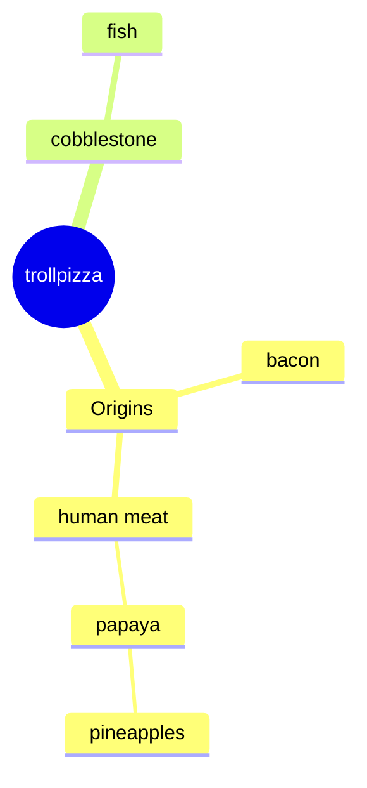

pizzeria AKA TROLLPIZZA
суть нашей пиццерии в том что все пиццы сделаны в виде тролльфейса и начинка всегда неизвестна покупателю
через приложение незарегистрированный человек может только сделать вещи такие как посмотреть меню и зарегестрироваться
зарегестрированный может ваще че хочет ну то есть заказать пиццу с рандомным вкусом сделать заказ оставить чаевые ну и все что клиент только захочет

```mermaid
sequenceDiagram
  participant Пользователь
  participant Веб-приложение
  participant Сервис аутентификации
  participant Платежный шлюз
  participant Сервис кошельков

  Пользователь->>Веб-приложение: Открыть страницу входа
  Веб-приложение->>Сервис аутентификации: Запросить токен аутентификации
  Сервис аутентификации->>Веб-приложение: Вернуть токен
  Веб-приложение->>Пользователь: Отобразить форму входа

  Пользователь->>Веб-приложение: Ввести логин/пароль
  Веб-приложение->>Сервис аутентификации: Отправить данные для проверки
  alt Проверка успешна
      Сервис аутентификации->>Веб-приложение: Проверка успешна
      Веб-приложение->>Пользователь: Перенаправление на главную страницу
  else Проверка не успешна
      Сервис аутентификации->>Веб-приложение: Проверка не успешна
      Веб-приложение->>Пользователь: Сообщение об ошибке
  end

  Пользователь->>Веб-приложение: Выбрать товар (виртуальную валюту)
  Веб-приложение->>Платежный шлюз: Инициировать платеж
  Платежный шлюз->>Пользователь: Перенаправление на страницу оплаты
  Пользователь->>Платежный шлюз: Ввод данных карты
  Платежный шлюз->>Пользователь: Подтверждение платежа

  Платежный шлюз->>Сервис кошельков: Уведомление о платеже
  Сервис кошельков->>Веб-приложение: Обновить баланс пользователя
  Веб-приложение->>Пользователь: Отобразить обновленный баланс
   ```


на данной диаграмме я показал выручку в течении года ну это по нашим ожидаемым результатам

```mermaid
xychart-beta
    title "выручка pizzeria AKA TROLLPIZZA"
    x-axis [jan, feb, mar, apr, may, jun, jul, aug, sep, oct, nov, dec]
    y-axis "Revenue (in $)" 0 --> 11000
    bar [5000, 6000, 7500, 8200, 9500, 10500, 11000, 10220, 12000, 11500, 0, 6000]
    line [5000, 6000, 7500, 8200, 9500, 10500, 11000, 10220,12000, 11500, 0, 6000]
```
в нашей пиццерии есть пиццы
*   пицца без одного кусочка
*   кусочек без пиццы
*   пицца без начинки
*   с ананасами
конечно же все пиццы в виде головы тролля,так же за отдельную плату вы можете попросить затроллить любого чела в инете

```mermaid
    user-->orderpizza;
    user-->checkmenu;
    user-->trollingpeople;
    troll-->troll;
```


вот диаграмма компонентов из чего наши повара делают пиццы


