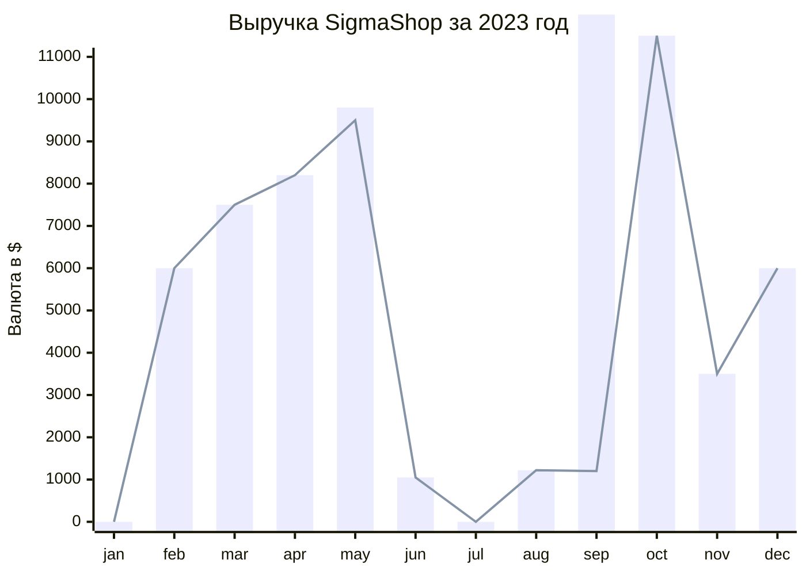
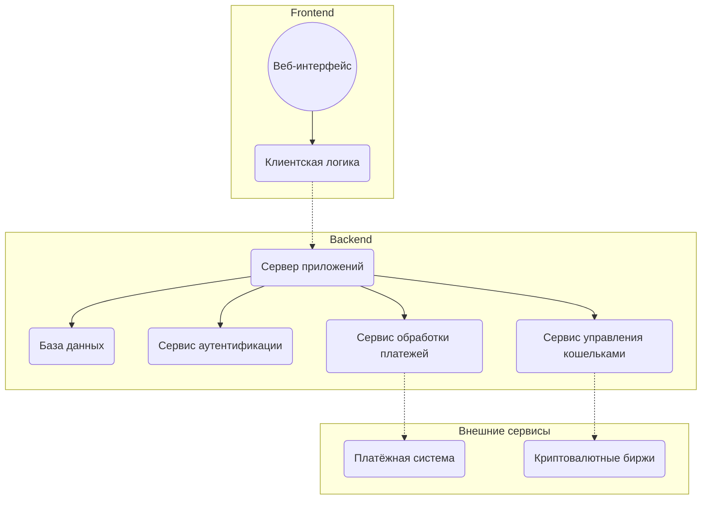

SigmaShop – это современный и надежный интернет-магазин, предлагающий широкий ассортимент виртуальных валют для различных нужд. Мы стремимся предоставить нашим клиентам удобные и безопасные способы приобретения цифровых активов, обеспечивая максимально комфортное пользовательское опыт.

Основные преимущества SigmaShop:

Широкий выбор: Наш магазин предлагает различные виды виртуальной валюты, включая Bitcoin, Ethereum, Litecoin и другие популярные криптовалюты.
Безопасность: Мы используем передовые технологии защиты данных и обеспечиваем высокий уровень безопасности всех транзакций.
Удобство использования: Простой и интуитивно понятный интерфейс позволяет легко находить нужную валюту и совершать покупку всего за несколько кликов.
Поддержка клиентов: Наша команда специалистов всегда готова помочь вам с любыми вопросами, связанными с покупкой и использованием виртуальной валюты.
Гибкие методы оплаты: Мы принимаем различные способы оплаты, чтобы обеспечить максимальную доступность наших услуг для каждого клиента.

Интерфейс платформы:
Удобный и интуитивно понятный интерфейс для покупки и продажи виртуальных валют.
Фильтрация по типу валюты, объему торгов и другим параметрам.
Возможность выбора различных типов активов (криптовалюты, токены, NFT и т.д.).
Информация о курсах валют и рыночных трендах.
Визуальная аналитика для прогнозирования изменений цен.

База данных:
Обновляемая база данных курсов криптовалют и других цифровых активов с актуальными данными.
Возможность добавления новых активов и удаления устаревших.

Система транзакций:
Функционал для совершения покупок и продаж выбранных активов.
Поддержка различных методов оплаты (банковские карты, криптовалюты, электронные кошельки).
История транзакций пользователя.

Служба поддержки:
Чат или телефонная линия для консультаций по вопросам использования платформы.
FAQ для решения распространенных вопросов.
Форум для обсуждения новостей рынка и обмена опытом среди пользователей.

Логистика:
Выбор способа вывода средств (на банковский счет, кошелек и т.п.).
Налаженная система обработки платежей и переводов.
Возможность отслеживания статуса транзакции.

Безопасность:
Защита пользовательских данных и информации о платежных операциях.
Соответствие стандартам безопасности и конфиденциальности.
Двухфакторная аутентификация для защиты аккаунтов.

Маркетинг:
Разработка стратегии продвижения проекта (реклама в социальных сетях, партнёрские программы).
Создание контента для привлечения целевой аудитории (аналитические статьи, обзоры криптовалют, интервью с экспертами).

Ниже вы можете наблюдать Sequence диаграмму  нашего магазина 
Демонстрация структурной системы для веб-приложения, связанного с конфигурацией.
```mermaid
sequenceDiagram
  participant Пользователь
  participant Веб-приложение
  participant Сервис аутентификации
  participant Платежный шлюз
  participant Сервис кошельков

  Пользователь->>Веб-приложение: Открыть страницу входа
  Веб-приложение->>Сервис аутентификации: Запросить токен аутентификации
  Сервис аутентификации->>Веб-приложение: Вернуть токен
  Веб-приложение->>Пользователь: Отобразить форму входа

  Пользователь->>Веб-приложение: Ввести логин/пароль
  Веб-приложение->>Сервис аутентификации: Отправить данные для проверки
  alt Проверка успешна
      Сервис аутентификации->>Веб-приложение: Проверка успешна
      Веб-приложение->>Пользователь: Перенаправление на главную страницу
  else Проверка не успешна
      Сервис аутентификации->>Веб-приложение: Проверка не успешна
      Веб-приложение->>Пользователь: Сообщение об ошибке
  end

  Пользователь->>Веб-приложение: Выбрать товар (виртуальную валюту)
  Веб-приложение->>Платежный шлюз: Инициировать платеж
  Платежный шлюз->>Пользователь: Перенаправление на страницу оплаты
  Пользователь->>Платежный шлюз: Ввод данных карты
  Платежный шлюз->>Пользователь: Подтверждение платежа

  Платежный шлюз->>Сервис кошельков: Уведомление о платеже
  Сервис кошельков->>Веб-приложение: Обновить баланс пользователя
  Веб-приложение->>Пользователь: Отобразить обновленный баланс
   ```
Вот простая диаграмма работы нашего магазина :
```mermaid
graph LR
    Start("Начало") --> Registration("Регистрация")
    Registration --> Login("Авторизация")
    Login --> ProductSelection("Выбор продукта")
    ProductSelection --> Checkout("Оформление заказа")
    Checkout --> Payment("Оплата")
    Payment --> OrderConfirmation("Подтверждение заказа")
    OrderConfirmation --> End("Завершение")
```

На диаграмме показана выручка с момента открытия до конца 2023 год




Ниже вы можете наблюдать диаграмму компонентов 
Здесь иллюстрируется, как различные компоненты приложения связаны друг с другом и как они обрабатывают данные пользователей и заказы.

